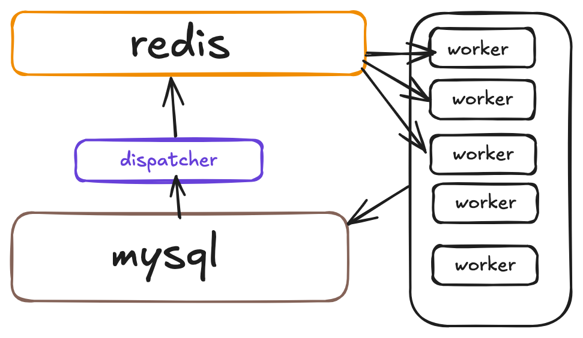

# distribution jobs for importing properties

this is a distribution jobs. 

## framework:

distribution framework.

## functions:

- dispatcher waiting for fetching data from mysql.
- dispatcher from mysql to redis and set status and locked_by, locked_time.
- dispatcher push to redis.
- workers pop the data from redis.
- workers get the data and process data.
- workers set status.
- workers waiting forever.